# robot_car3
Moving to version 3

Car is not getting more fancy or cool, its hosted in a small platic lunch box so a bit instable
Lets see if I can improve on the HW in next generation

Ok but back to the core things, HW is cool but not the esential yet
Everything is broken up into small modules
The ardunio part is just focusing on gathering sensor data and has been improved a bit
A Sg-90 servo motor is used to rotate 3-177 degree to allow a bit if HW limitation as it do not realy cover 180 degree
I have attached 4 sensors on top of the servo to gather almost 360 degrees data information, 2 sensors on each side ultrasonic and infrared sensor
In the fron of the car I have a IR bumper to sense if we colide and an ultrasonic sensor

[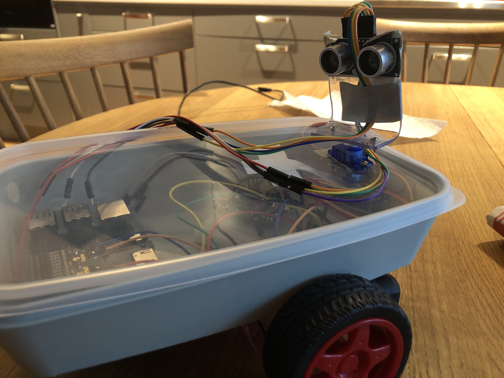](image_car2/image_car3/IMG_2080.jpeg)
[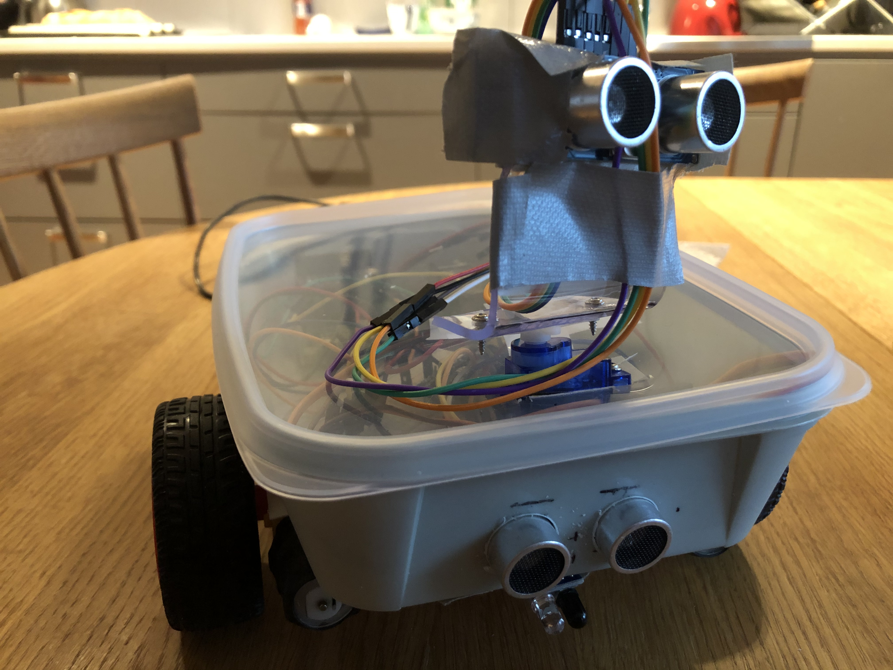](image_car2/image_car3/IMG_2081.jpeg)
[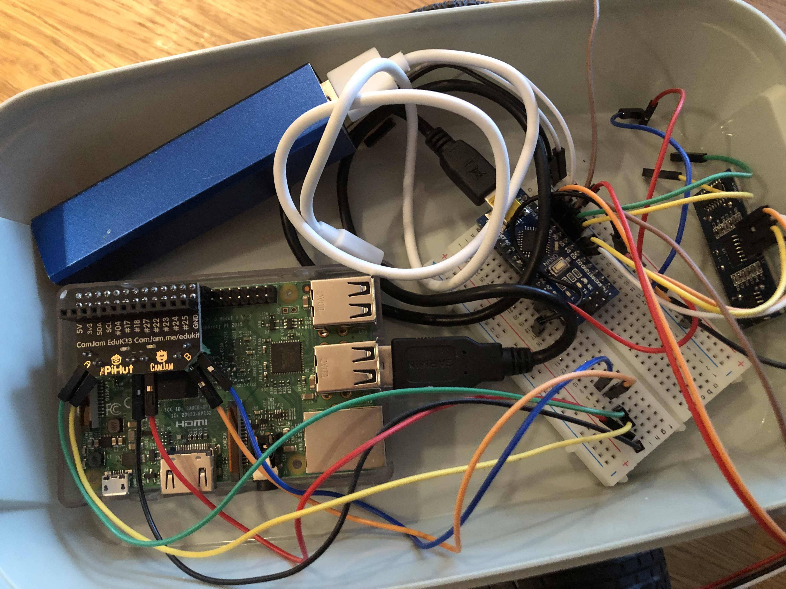](image_car2/image_car3/IMG_2082.jpeg)

And information on performance of the new model

The Logic and nodes
In this version everything is broken up into small modules a node to make each part independent
For example I have a motor power node that subscribes to two topics emergency break and motor power
this node has no inteligence at all it just controls the motor power
The emergency break prevents any movement until break are released by bumper or that we overide and force a movement to get out of the situation
It also publish current state and an estimation of speed based on collected information of power in relation to moving against an obstacle

We have then distance sensor collector node, collecting sensor information from the arduino card where I have hocked in 3 ultrasonic sensors
one fron and 2 sitting on the servo to get a 360 distance view
And a front bumper ir sensor
This node sends an emergency break message to the motor node if bumper is set and then a release of break when we are far enough for a reset
It also publish front distance and scanner distance

# robot_car2
Moving this to version 2
- Adding ardunio card for sensor data collection
Multi sensor autodriving car

Current key objectives:
- Avoid objects by moving forward and turning around (sensors is only in front and on the sides)
- Variable speed, slow down when closer to objects
status: meet

Next key level of objective:
- Follow the walls
- Avoid getting trapped, one sugestion is to reverse movements if we are stuck

Comming objectives
- attach camera, use it for recognition
- map room

Version 2
Is inproved by moving ultrasonic side sensors more to the front and replacing side sensors with ir sensors (10-80 cm)
With the new ultrasonic coverage in the front we get a better view of if we are risking to hit an obstacle.
Core components:
2 Motors + battery pack for motors
Motor controller board
Raspberry pi
3 HC-SR04 ultrasonci sensors
3 Sharp IR distance sensors
Library needed for ardunio sharp ir sensor https://www.arduinolibraries.info/libraries/z-sharp-ir-library
Arduino Nano kompatibelt V3.0 ATMEGA328 
You also need a bunch of cabels

With the arduino providing analogical input for IR sensors, and I also moved my ultrasonic sensors to arduino.
My sendor prints the result in a : separated format to be onsumed by ros node
Sensor code has been improved to handle some of the non connsisent values from ultrasonic sensors, sometime they generate a high value if it can not get a corrct measuare and that is ignored and previous distance is used.
See ardunio directory.
For IR sensors I used a library for SHARP ir sensors to calculate the right distance based on a complex response curve.
https://drive.google.com/file/d/1yglX0lYazxgC3TkjZ83E_IVw0gYlycW0/view

More code is comming, at the moment I am wring the node intigrating arduino, its basic time out based readline process which is pushing the data to topics.
I plan then to buil a few more nodes
- arduinoSensor.py # Colleting sensor data and publishing it on topics
- driverv2.py # node planning the movement based on sensor data
- autocar.py # node based on goal based driving

To enable SLAM I have started to calculate speed from ultrasonic sensors to be used by central node to calibrate speed based on motor power, my working idea is that robot find a wall and drive against it a number of time with different motor power to collect a power to speed translation table.
With this information we can start tracking how far we moved.

[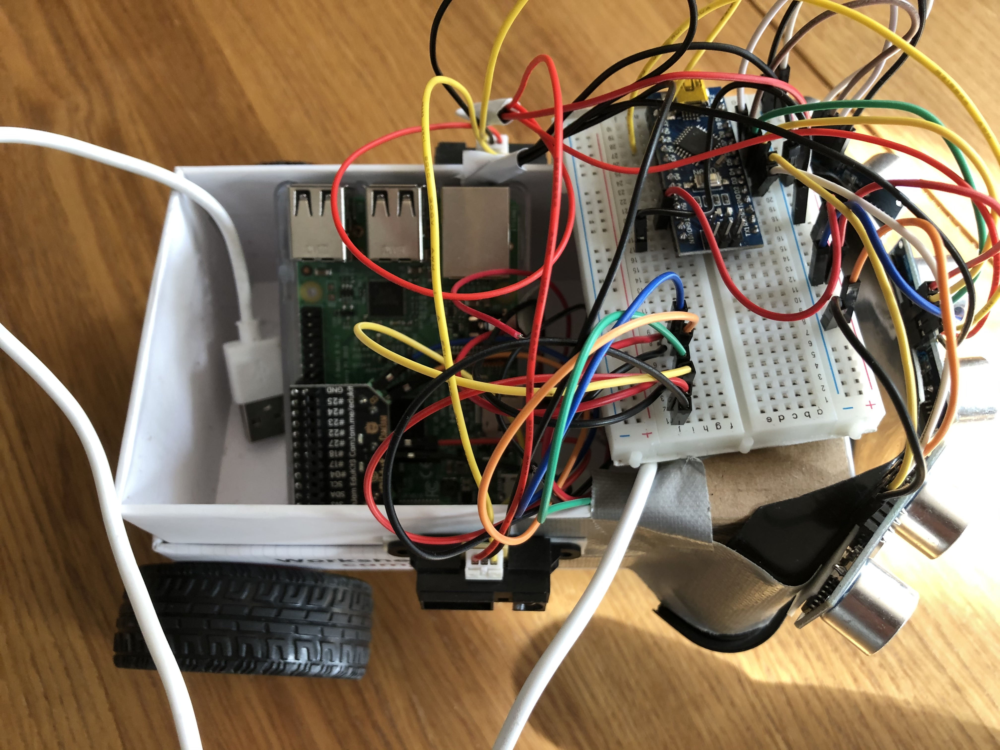](image_car2/IMG_2060.jpeg)
[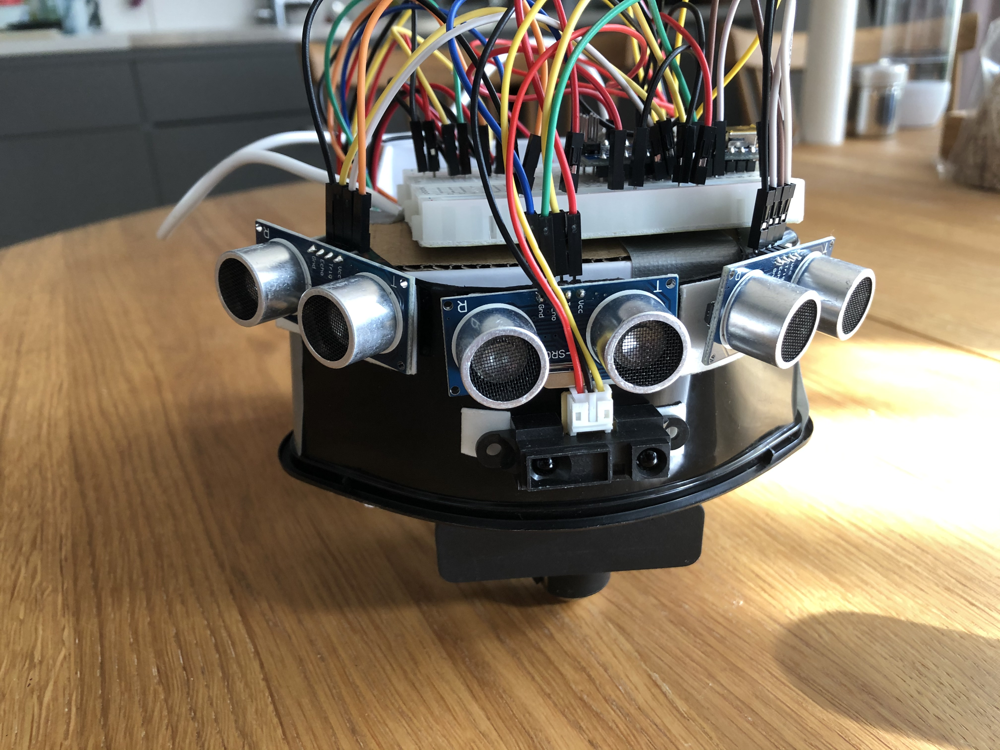](image_car2/IMG_2061.jpeg)
[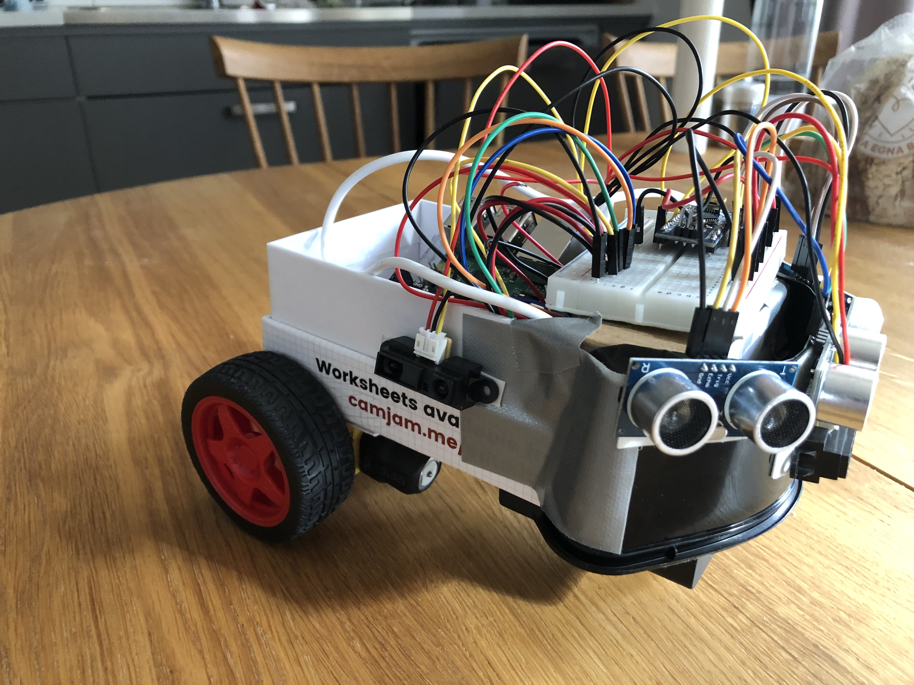](image_car2/IMG_2062.jpeg)
[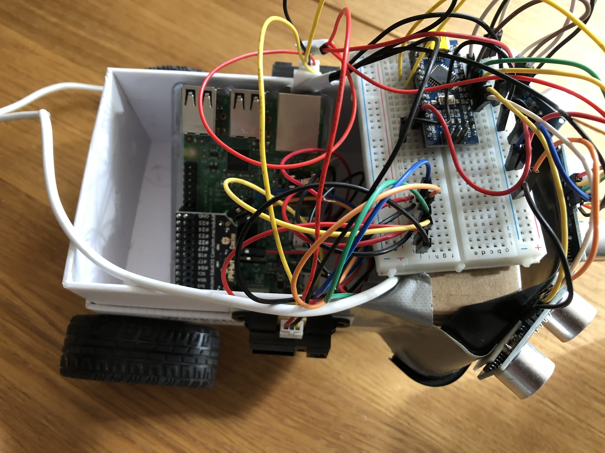](image_car2/IMG_2063.jpeg)

Version 1
Key python nodes are;
- usdistance.py
- driver.py
Core components:
2 Motors + battery pack for motors
Motor controller board
Raspberry pi
3 HC-SR04 ultrasonci sensors
You also need a bunch of cabels
Current improvement areas is
- When direction is not forward use distance to optimize where to go, try turn and if forward distance is ok go forward a litle
- But in general a  smarter algorithm for movement is needed

To handle this I am using two nodes
- A distance dection node, wich is a bit of the smart part identifying where to to go and keeping track of distnace
-- It is populating following event topics
--- distance the closest distance to an obstacle
--- direction a proposed direction based on the closest obstacle
--- frontdistance (obviuous)
--- leftdistance (obvious)
--- rightdistance (obvious)
- Second node is autodrive that controlles the motors and subscribes to distance and direction topics
-- Distance information is used to controle the speed
-- Direction is the guidance for which direction to drive to

Click tp see the video when it tries to avoid crashing
[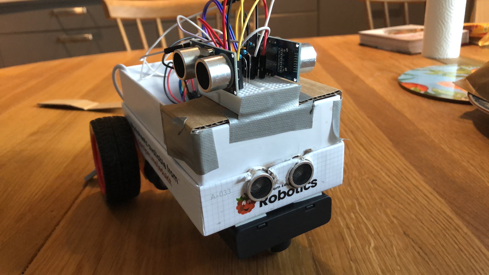](https://youtu.be/d5yBfNilb-g)
Below is some good pictures
[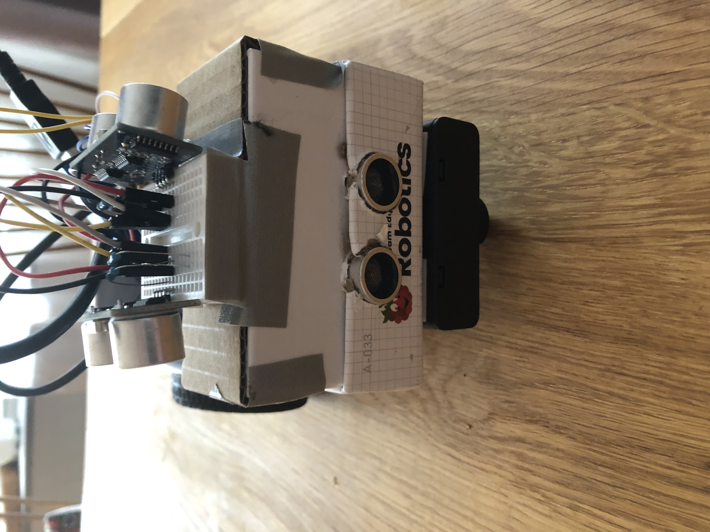](image_car2/IMG_2048.jpeg)

[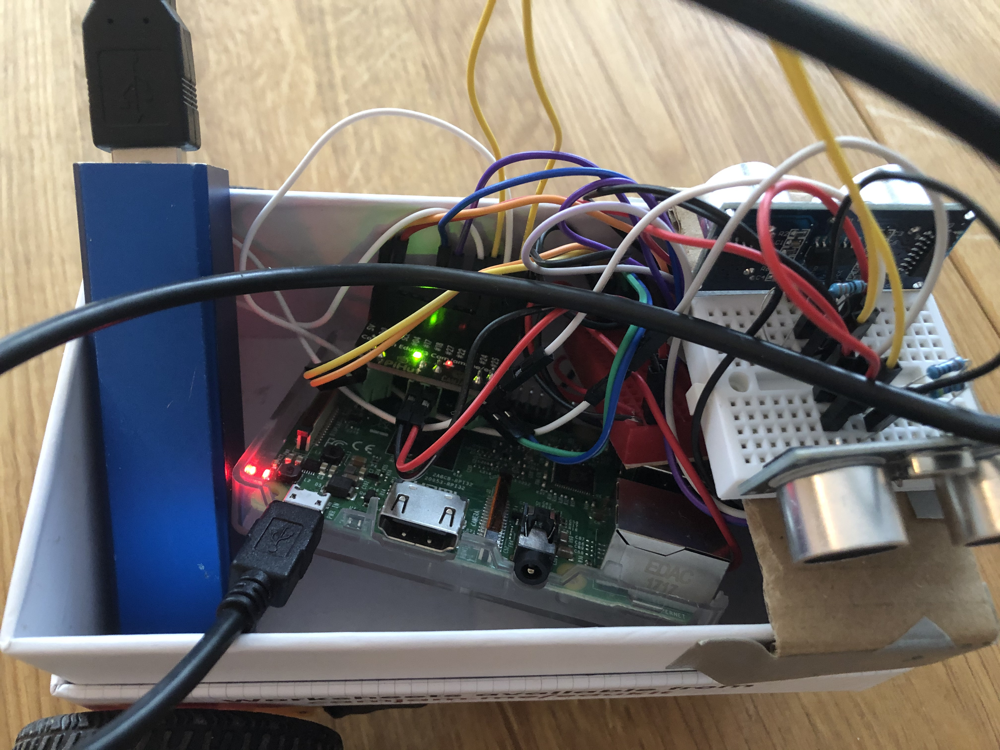](image_car2/IMG_2049.jpeg)
[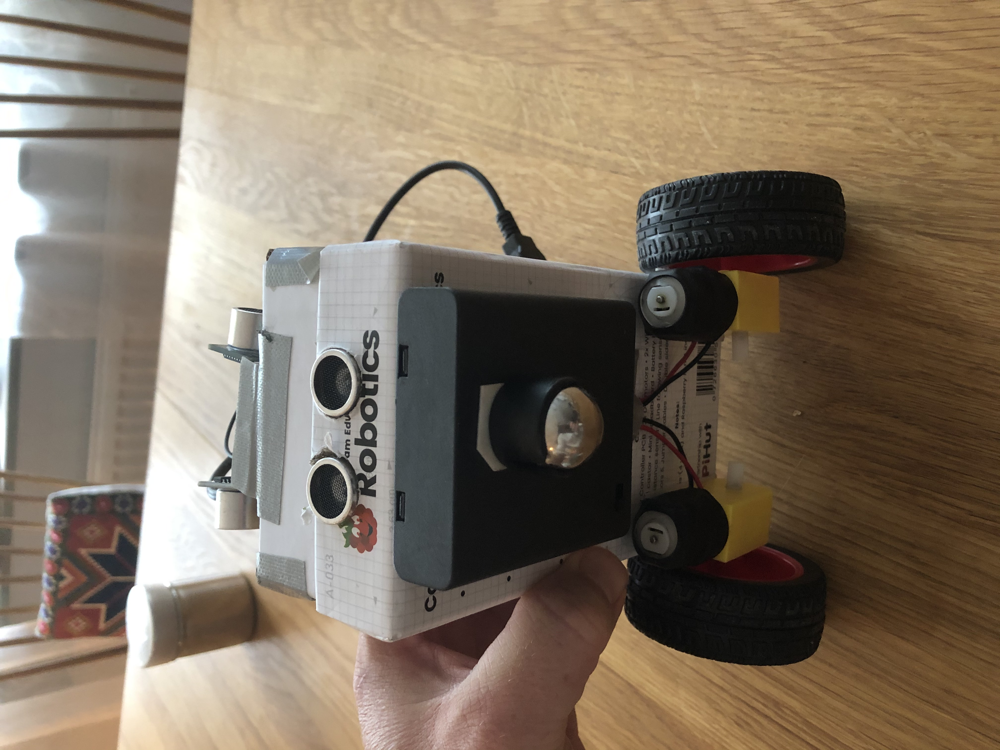](image_car2/IMG_2050.jpeg)

